# Distro Skill Tree

This page contains an interactive chart for navigating paths to obtaining
permissions to upload changes to Ubuntu archive. This can be used as a model
to help build an application for things such as certain packagesets, 
[MOTU](https://wiki.ubuntu.com/MOTU), 
[CoreDev](https://wiki.ubuntu.com/UbuntuDevelopers#Ubuntu_Core_Developers) 
as examples.

```mermaid
%% mermaid flowcharts documentation: https://mermaid.js.org/syntax/flowchart.html
%%{ init: { 'flowchart': { 'curve': 'monotoneY' } } }%%
flowchart TD
    %% Styles
    classDef Invisible stroke-width:0,fill:#00000000 

    %% Transitions
    Start-->|"Path to Distro Contribution"| Basics

    subgraph Basics
        direction TB
        subgraph InitialStudies["Initial Studies"]
            direction BT
            %% Concepts{{"Concepts"}}
            Concepts{{"<a href=https://github.com/canonical/ubuntu-maintainers-handbook>Concepts</a>"}}
            Git-Ubuntu{{"Git-Ubuntu"}}
            Debian-Policy{{"<a href=https://www.debian.org/doc/debian-policy/>Debian Policy</a>"}}
        end
        subgraph InitialTasks["Initial Tasks"]
            direction BT
            BiteSizedBugs((Bite Sized Bugs fa:fa-ban))
            TrivialPackgeMerges(("Trivial Package Merges"))
        end
    end
    InitialStudies --> InitialTasks

    Basics -->|"Team/Mentor Says ready for more"| Intermediate
    subgraph Intermediate
        direction TB
        subgraph IntermediateTasks
            direction TB
            %% States
            ComplexPackageMerges(("Complex Package Merges"))
            ProposeMigration(("<a href=https://wiki.ubuntu.com/ProposedMigration>Proposed Migration</a>"))
            UnderstandDep8{{"<a href=https://salsa.debian.org/ci-team/autopkgtest/blob/master/doc/README.package-tests.rst>Understand DEP8</a>"}}
            AddAUTOPKGTESTS(("<a href=https://github.com/canonical/ubuntu-maintainers-handbook/blob/main/PackageTests.md>Add Autopkgtest</a>"))
            SRU{{"<a href=https://wiki.ubuntu.com/StableReleaseUpdates>Study SRU</a>"}}
            DoSRUS(("Do SRUS"))

            %% Transitions
            UnderstandDep8 --> AddAUTOPKGTESTS
            ComplexPackageMerges --> ProposeMigration
            SRU --> DoSRUS
        end
        IntermediateKeepGoing["Do enough of these to apply for package or group uploads"]
        IntermediateTasks --> IntermediateKeepGoing --> IntermediateTasks
    end
    
    Intermediate -->|"Team/Mentor Says ready for more"| Advanced

    subgraph Advanced
    direction LR
        subgraph AdvancedTasks
            direction LR
            %% States
            UpstreamSubmissionFixes(("Upstream Submission Fixes/Features"))
            UpstreamSubmissionDelta(("Upstream Submission of Delta"))
            MilestonesAndExceptions(("Milestones And Exceptions"))
            StudyFFE{{"<a href=https://wiki.ubuntu.com/FreezeExceptionProcess>Study FFE</a>"}}
            DoAnFFE(("Do An FFE"))
            PlusOne{{"<a href=https://wiki.ubuntu.com/PlusOneMaintenanceTeam>Study +1</a>"}}
            PlusOneShadowing(("+1 Shadowing"))

            %% Transitions
            StudyFFE-->DoAnFFE
            PlusOne-->PlusOneShadowing
        end
        AdvancedKeepGoing["Do enough of these to apply for MOTU"]
        AdvancedTasks --> AdvancedKeepGoing --> AdvancedTasks
    end

    Advanced --> optionalDebian
    MOTU{"<a href=https://github.com/canonical/ubuntu-maintainers-handbook/blob/main/MembershipInMOTU.md>MOTU</a>"}
    Advanced --> MOTU --> Expert

    subgraph optionalDebian
        Contribute(("<a href=https://www.debian.org/doc/manuals/maint-guide/>Contribute</a>"))
        DM{"<a href=https://wiki.debian.org/DebianMaintainer>DM</a>"}
        DD{"<a href=https://wiki.debian.org/DebianDeveloper>DD</a>"}
        Contribute --> DM
        DM --> DD
    end

    subgraph Expert
        direction LR
        subgraph ExpertTasks
            direction TB
            StudyLibaryTransitions{{"<a href=https://wiki.debian.org/Teams/ReleaseTeam/Transitions>Study Libary Transitions</a>"}}
            DoLibaryTransitions(("Do Libary Transitions"))
            StudyPackageTransitions{{"<a href=https://wiki.debian.org/PackageTransition>Study Package Transitions</a>"}}
            DoPackageTransitions(("Do Package Transitions"))
            StudyMIR{{"<a href=https://github.com/canonical/ubuntu-mir/edit/main/README.md>Study MIR</a>"}}
            DoMIR(("Do a MIR"))
            SeedChange(("Seed Change"))
            StudyLibaryTransitions-->DoLibaryTransitions
            StudyPackageTransitions-->DoPackageTransitions
            StudyMIR-->DoMIR
            StudyMIR-->SeedChange
        end
        ExpertKeepGoing["Do enough to apply for core-dev"]
        ExpertTasks-->ExpertKeepGoing-->ExpertTasks
    end

    CoreDev{"<a href=https://github.com/canonical/ubuntu-maintainers-handbook/blob/main/MembershipInCoreDev.md>Core Developer</a>"}

    Expert --> CoreDev --> Duties

    subgraph Duties
        direction LR
        CoreDevPlusOne(("+1"))
        Sponsoring(("Sponsoring"))
        Mentoring(("Mentoring"))
    end

```

